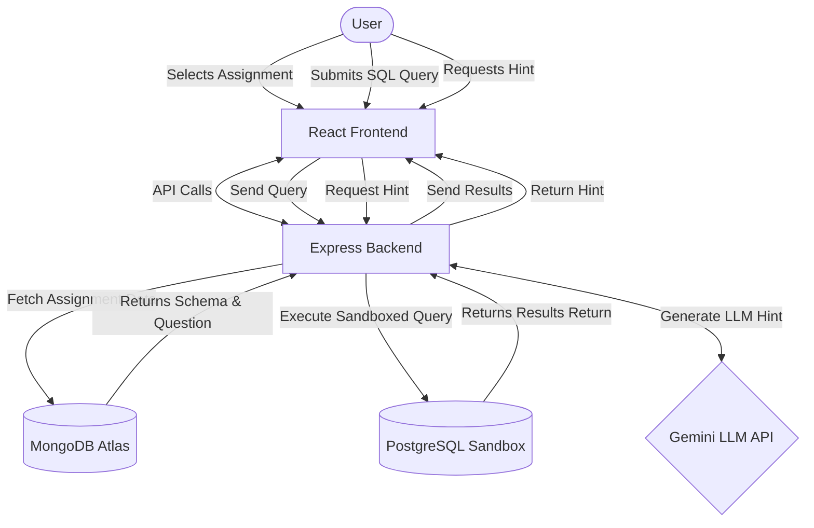

# CipherSQL Studio - Architecture & Data Flow

This document outlines the high-level system architecture and the data flow sequence for user interactions within the application.

## System Components

- **Frontend (React.js / Vite)**: Handles user interface, assignment presentation, and code editing via Monaco Editor.
- **Backend (Node.js / Express)**: Orchestrates API requests, manages active database connections, and proxies LLM requests.
- **Assignment Library (MongoDB)**: Stores assignment metadata, schema definitions, correct answers, and guiding questions.
- **Sandbox Execution (PostgreSQL via `pg-mem`)**: Ephemerally spins up a database instance with mock data and evaluates the user's SQL string, isolating potentially destructive queries.
- **Hint Engine (Gemini API)**: Processes the student's current SQL attempt and generates educational hints without solving the problem outright.

## Data Flow Diagram

