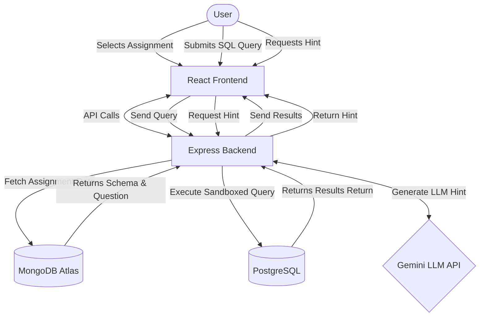

# CipherSQL Studio

CipherSQL Studio is a browser-based SQL learning platform where students can practice SQL queries against pre-configured assignments with real-time execution and intelligent hints from an LLM.

## Architecture & Data Flow



### Why these technologies?

- **React.js & Vanilla SCSS**: Provides a modern component-centric framework while adhering to the assignment's explicit requirement for vanilla CSS/SCSS (BEM convention, mobile-first responsiveness).
- **Express.js & MongoDB**: Express handles the API routing easily, while MongoDB provides flexible storage for Assignment metadata (questions, schemas, etc.).
- **PostgreSQL**: Used as the sandbox runtime to natively execute standard SQL queries submitted by users. Our implementation securely handles in-memory sandboxing (`pg-mem`) to ensure perfect isolation without local configuration overhead.
- **Gemini API**: Used as the underlying LLM to generate secure, guiding hints based on prompt engineering without giving away the final SQL answers.

## Prerequisites

- Node.js (v18+)
- MongoDB (Atlas or Local)
- PostgreSQL (Local or Cloud DB)
- Gemini API Key

## Setup Instructions

1. **Clone the repository** (or navigate to the project root folder).
2. **Setup the Backend**:
   ```bash
   cd backend
   npm install
   cp .env.example .env
   # Edit .env with your actual MONGODB_URI, DATABASE_URL, and GEMINI_API_KEY
   ```
3. **Seed the Database (Initial Setup)**:
   ```bash
   node seed.js
   ```
   _Note: This script pushes mock assignments to MongoDB and provisions initial tables in the PostgreSQL Sandbox database._
4. **Start the Backend Server**:
   ```bash
   node server.js
   # Running on http://localhost:5000
   ```
5. **Setup and Start the Frontend**:
   ```bash
   cd ../frontend
   npm install
   npm run dev
   # Running via Vite on typically http://localhost:5173
   ```

## Mobile First UI

The styling implements a strict mobile-first approach using Vanilla SCSS (`frontend/src/styles/`), breaking at `641px`, `1024px`, and `1281px`. It relies on flexbox and grid to adjust the multi-panel workspace view accordingly.
