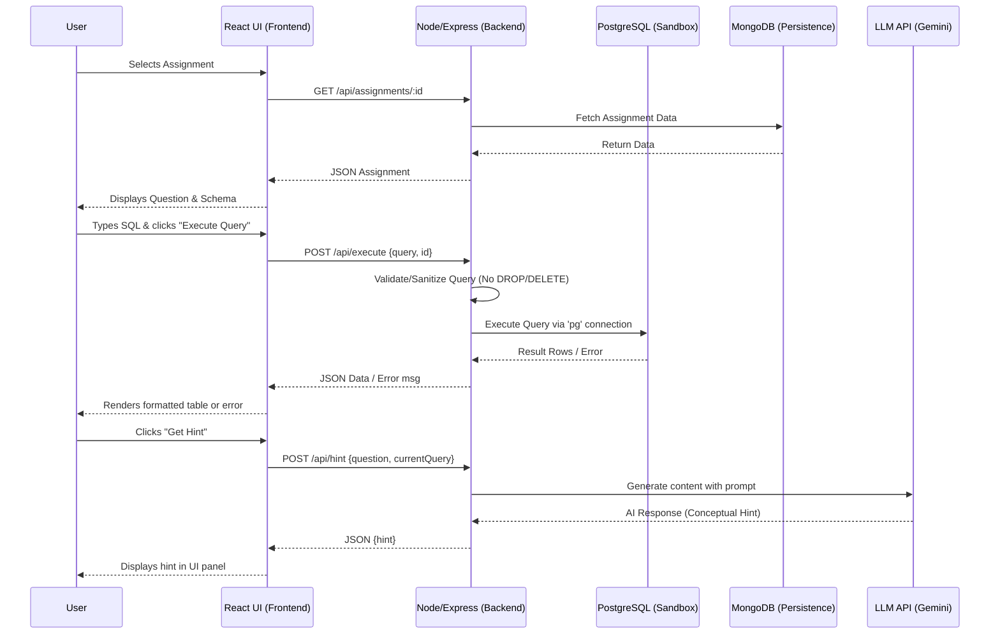

```mermaid
sequenceDiagram
    participant User
    participant React UI (Frontend)
    participant Node/Express (Backend)
    participant PostgreSQL (Sandbox)
    participant MongoDB (Persistence)
    participant LLM API (Gemini)

    User->>React UI (Frontend): Selects Assignment
    React UI (Frontend)->>Node/Express (Backend): GET /api/assignments/:id
    Node/Express (Backend)->>MongoDB (Persistence): Fetch Assignment Data
    MongoDB (Persistence)-->>Node/Express (Backend): Return Data
    Node/Express (Backend)-->>React UI (Frontend): JSON Assignment
    React UI (Frontend)-->>User: Displays Question & Schema
    
    User->>React UI (Frontend): Types SQL & clicks "Execute Query"
    React UI (Frontend)->>Node/Express (Backend): POST /api/execute {query, id}
    Node/Express (Backend)->>Node/Express (Backend): Validate/Sanitize Query (No DROP/DELETE)
    Node/Express (Backend)->>PostgreSQL (Sandbox): Execute Query via 'pg' connection
    PostgreSQL (Sandbox)-->>Node/Express (Backend): Result Rows / Error
    Node/Express (Backend)-->>React UI (Frontend): JSON Data / Error msg
    React UI (Frontend)-->>User: Renders formatted table or error
    
    User->>React UI (Frontend): Clicks "Get Hint"
    React UI (Frontend)->>Node/Express (Backend): POST /api/hint {question, currentQuery}
    Node/Express (Backend)->>LLM API (Gemini): Generate content with prompt
    LLM API (Gemini)-->>Node/Express (Backend): AI Response (Conceptual Hint)
    Node/Express (Backend)-->>React UI (Frontend): JSON {hint}
    React UI (Frontend)-->>User: Displays hint in UI panel
```
